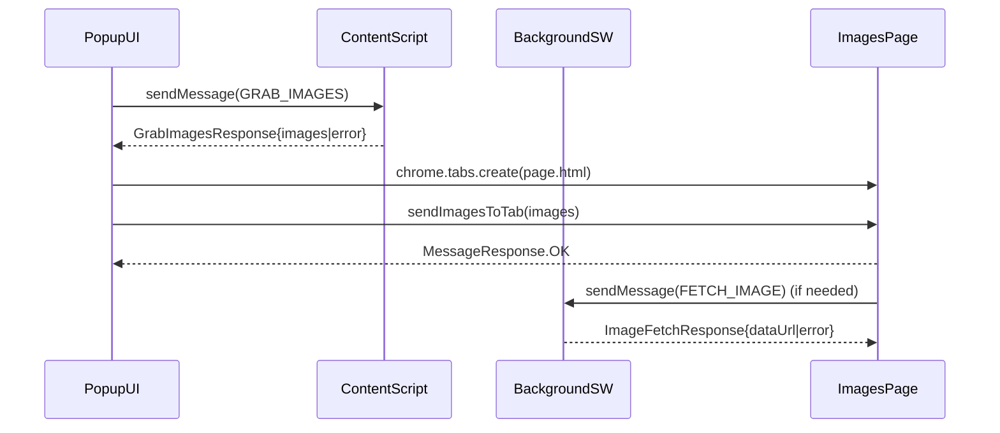

## Extension architecture flow (MV3)

### Message/data flow

### Implementation anchors (where to look)
- **Popup → content script wrapper**: `src/utils/contentScriptUtils.ts` (`sendMessageToContentScript`)
- **Popup → page tab image payload**: `src/utils/messaging.ts` (`sendImagesToTab`)
- **Content script handlers**: `src/contentScript/content-script.ts`
- **Background privileged work (downloads/CORS/DNR rules)**: `src/background/index.ts`
- **Message enums and payload types**: `src/types/index.ts`

